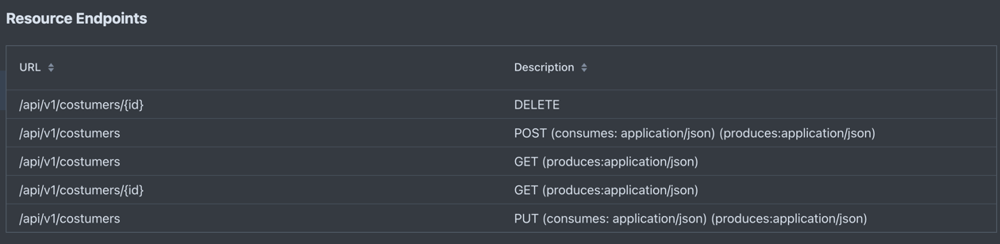

# Book Rental Application

This project is a book rental system built using a microservices architecture. It consists of three main microservices:

## Microservices

### 1. Book Service
Manages book inventory, details, and availability.

### 2. Costumer Service
Handles customer information, registration, and management.

### 3. Reservation Service
Manages book reservations, rental periods, and returns.

## Running the Application
Each microservice is a separate Quarkus project. Navigate to the respective folder (`book/`, `costumer/`, `reservation/`) and follow the instructions in their individual README files to build and run each service.

## API Visualization

The API endpoints for each microservice are documented and visualized using Quarkus DEV UI. Below are screenshots showing the available endpoints and models for each microservice.

## Quarkus Dev UI Screenshots

### Book Service Endpoints

### Costumer Service Endpoints

### Reservation Service Endpoints

